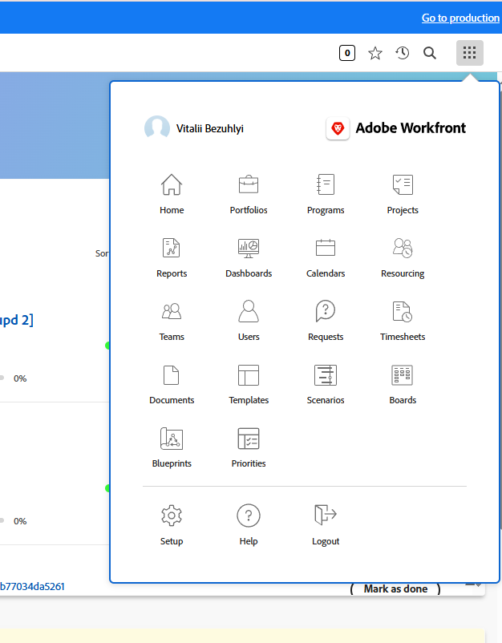
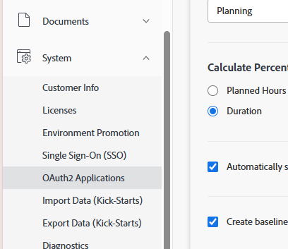
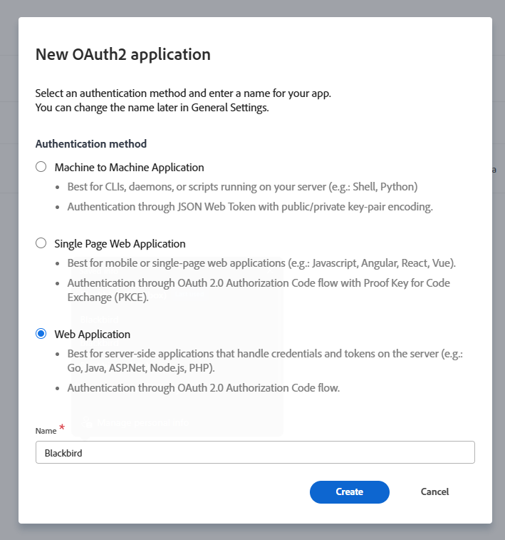
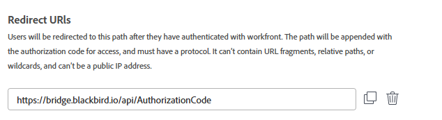
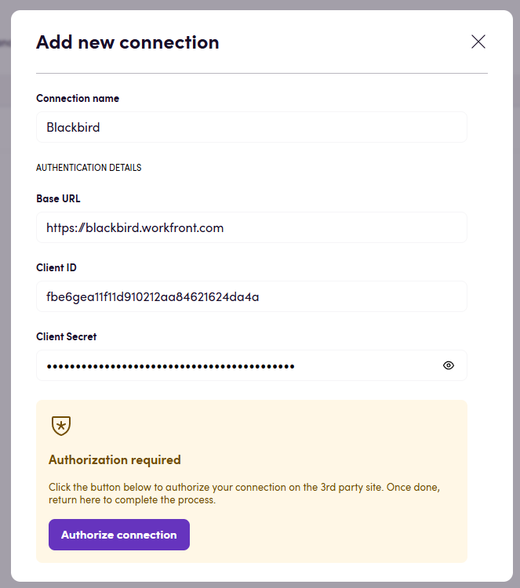

# Blackbird.io AdobeWorkfront

Blackbird is the new automation backbone for the language technology industry. Blackbird provides enterprise-scale automation and orchestration with a simple no-code/low-code platform. Blackbird enables ambitious organizations to identify, vet and automate as many processes as possible. Not just localization workflows, but any business and IT process. This repository represents an application that is deployable on Blackbird and usable inside the workflow editor.

## Introduction

<!-- begin docs -->

Adobe Workfront is a cloud-based work management solution designed to help teams and organizations efficiently plan, track, and manage their work. It streamlines project management, task collaboration, resource management, and portfolio management across various teams and departments. Additionally, it serves as a leader in enterprise work management, enabling teams to connect, collaborate, and simplify workflows to deliver personalized experiences at scale. With features that support large enterprises, Adobe Workfront helps in building a centralized marketing system of record.

## Before setting up

Before you connect to Adobe Workfront, make sure you have the following:

- An active Adobe Workfront account with sufficient permissions to create projects, tasks, and users.
- Your Workfront instance must be **web-accessible** from the Blackbird platform (e.g., no restrictive firewall blocking access).
- Your **Workfront domain (base URL)**. This is usually in the form:  
  `https://yourdomain.my.workfront.com`
- An **OAuth2 application** created inside Workfront. The OAuth2 application will provide you with a **Client ID** and **Client Secret**, which are required to set up the connection in Blackbird.

To create an OAuth2 application in Workfront:

1. Log in to your Workfront instance.
2. In the top-right corner, click the **grid icon** (the square of dots) and select **Setup**.  
   
3. In the left-side menu, expand **System** and select **OAuth2 Applications**.  
   
4. Click **Create app integration**.
5. In the **New OAuth2 application** dialog, select **Web Application** as the authentication method.  
   
6. Enter a name for the application (e.g., *Blackbird*).
7. In the **Redirect URIs** section, add the following URI: `https://bridge.blackbird.io/api/AuthorizationCode`
   
8. Adjust **token expiration settings** according to your needs
9. Add client secret by clicking on **Add client secret** button.
   
10. After creation, copy your **Client ID** and **Client Secret**.

> ⚠️ Important: The **Client Secret** is only shown once. Store it securely. If lost, you will need to generate a new secret by editing or recreating the app.

Once you have your **Base URL**, **Client ID**, and **Client Secret**, you are ready to set up the connection in Blackbird.

## Connecting

1. Navigate to **Apps** in Blackbird and search for **Adobe Workfront**.
2. Click _Add Connection_.
3. Name your connection for future reference, e.g., **My Workfront**.
4. Fill in the following fields:

   - **Base URL**: Your Workfront instance URL.  
     Example: `https://your-adobe-workfront-domain.com`

   - **Client ID**: The Client ID you obtained when creating your OAuth2 application in Workfront.

   - **Client Secret**: The Client Secret you obtained when creating your OAuth2 application in Workfront.
     > ⚠️ Important: This value is shown only once during app creation in Workfront. Make sure you have stored it securely.

5. Click _Connect_.
6. Confirm that the connection has appeared and the status is **Connected**.

## Actions

### Projects

- **Search projects**: Returns a list of projects based on specified criteria.
- **Get project**: Retrieves details of a project by its ID.
- **Create project**: Creates a new project with the provided details.
- **Update project**: Updates an existing project with new details.
- **Delete project**: Deletes a project by its ID.

### Tasks

- **Search tasks**: Returns a list of tasks based on specified criteria.
- **Get task**: Retrieves details of a task by its ID.
- **Create task**: Creates a new task and optionally assigns users.
- **Update task**: Updates an existing task and optionally reassigns users.
- **Delete task**: Deletes a task by its ID.

### Documents

- **Upload file**: Uploads a file and attaches it to a task or project.
- **Download document**: Downloads a document by its ID.

### Custom fields

- **Get string custom field value**: Returns the value of a custom field for a specific object.
- **Set string custom field value**: Updates the value of a custom field for a specific object.

## Events

### Projects

- **On project created**: Triggered when a new project is created.
- **On project changed**: Triggered when any property of a project changes.
- **On project status changed**: Triggered when a project's status changes.

### Tasks

- **On task created**: Triggered when a new task is created.
- **On task changed**: Triggered when any property of a task changes.
- **On task status changed**: Triggered when a task's status changes.

### Documents

- **On document uploaded**: Triggered when a new document is uploaded.

## Feedback

Do you want to use this app or do you have feedback on our implementation? Reach out to us using the [established channels](https://www.blackbird.io/) or create an issue.

<!-- end docs -->
